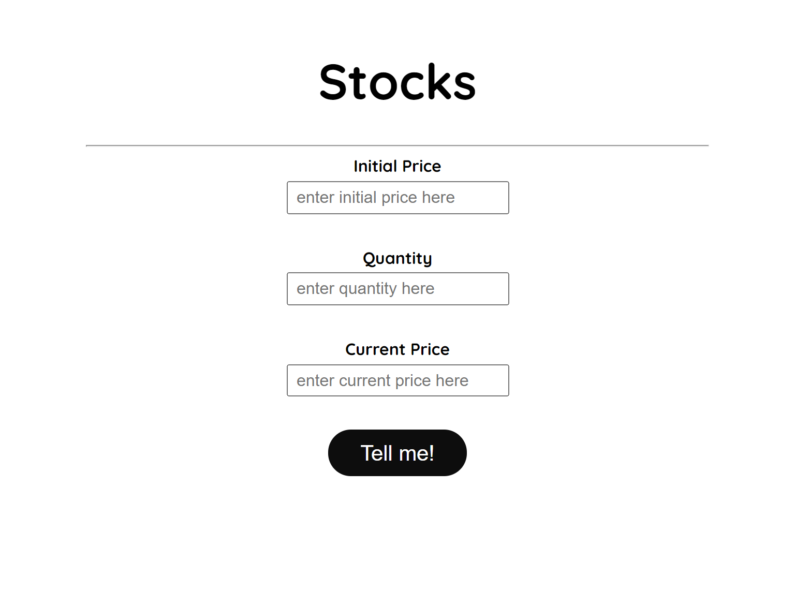

# Stocks Profit and Loss

An app that calculates profit or loss based on user's input of the stock price and its quantity.

## Overview

### Screenshot

### Links

- Live Site URL: [https://stock-profit-loss-darshan.netlify.app/](https://stock-profit-loss-darshan.netlify.app/)

### Built with

- HTML5
- CSS
- JavaScript

## Author

- Twitter - [@DarshanDamre](https://twitter.com/DarshanDamre)
- LinkedIn - [Darshan Damre](https://www.linkedin.com/in/darshandamre/)
- Website - [Darshan Damre](https://darshandamre.netlify.app/)
